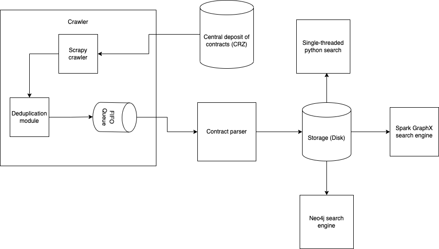

# CRZ Search

Project implements a solution to find relationships and commonalities between 2 given Slovak companies. The motivation
behind this project is to identify suspicious connections and activities between legal 2 entities and help investigators
discover potential illegal activities (e.g. money loundry, frauds, corrupcy schemes).

It utilizes scraped data from the Central
deposit of contracts ([CRZ](https://www.crz.gov.sk/)) in Slovak republic where each contract involving a public (government) facility is publicly available. 
Scrapy crawler is used for this purpose. Parsed data records are stored on the disk and fed into 3 different search engines. All of them implement the same search functionality using different approaches for demonstration purposes.





# Project structure
`/indexer` python implementation of the single-threaded search

`/crawler` implementation of the contract crawler

`/parser` implementation of the contract parser

`/test` unit tests

`Spark.ipynb` demonstrate how Spark GraphX can be used for the search

`/neo4j` imlpementation of the search using the Neo4j graph database.


# Install dependencies

Python 3.9.7

```
pip install -r requirements.txt
```

# Run the crawler

```
python -m scrapy runspider ./crawler/crawl.py  -o output.jl
```

# Running Tests

```
python -m pytest
```

# Running in Spark

Preprocess data for Spark

```
python create_spark_tables.py
```

Download spark Docker image for local development

```
docker pull jupyter/pyspark-notebook
```

Run the container in detached mode

```
docker run -p 8889:8889 -d -p 4040:4040 -p 4041:4041 -v /Users/tomashoffer/Documents/Coding-Projects/vinf:/home/jovyan -it --rm --name pyspark-notebook jupyter/pyspark-notebook
```

Run Jupyter notebook with Spark from within the container

```
docker exec -it pyspark-notebook bash

export PYSPARK_DRIVER_PYTHON=jupyter
export PYSPARK_DRIVER_PYTHON_OPTS=notebook
pyspark --packages graphframes:graphframes:0.8.2-spark3.2-s_2.12
```

Jupyter notebook server now listens on localhost:8089. `Spark.ipynb` contains an example of running various graph
queries.

# Running in Neo4j

Preprocess data for import into Neo4j. This will create csv files containing nodes and relationships to be imported into
Neo4j. Files are stored in the `meo4j_data` directory.

```
python create_neo4j_tables.py
```

Copy the created files into the `\import` directory of your Neo4j DB instance.

In case the database contains some data, wipe all data before proceeding with bulk import. Open the terminal of your
Neo4j DB instance and execute:

```
rm -rf ./data/*
```

Make sure the Neo4j DB is not running. Open the DB terminal and execute the following command to run the bulk import.
The first line sets the heap size. The higher the heap size, the faster the import will be. Adjust the heap size based
on your available memory.

```
export HEAP_SIZE=5g
./bin/neo4j-admin import --database neo4j --nodes=import/companies_header.csv,import/companies.csv  --nodes=import/cities_header.csv,import/cities.csv --nodes=import/zips_header.csv,import/zips.csv --nodes=import/streets_header.csv,import/streets.csv --relationships=import/relationships_contract_header.csv,import/relationships_contract.csv --relationships=import/relationships_city_header.csv,import/relationships_city.csv --relationships=import/relationships_street_header.csv,import/relationships_street.csv --relationships=import/relationships_zip_header.csv,import/relationships_zip.csv --skip-bad-relationships
```

Create the index on Company name to speed-up queries:

```
CREATE INDEX company_id_index IF NOT EXISTS
FOR (n:Company)
ON (n.id);
```
