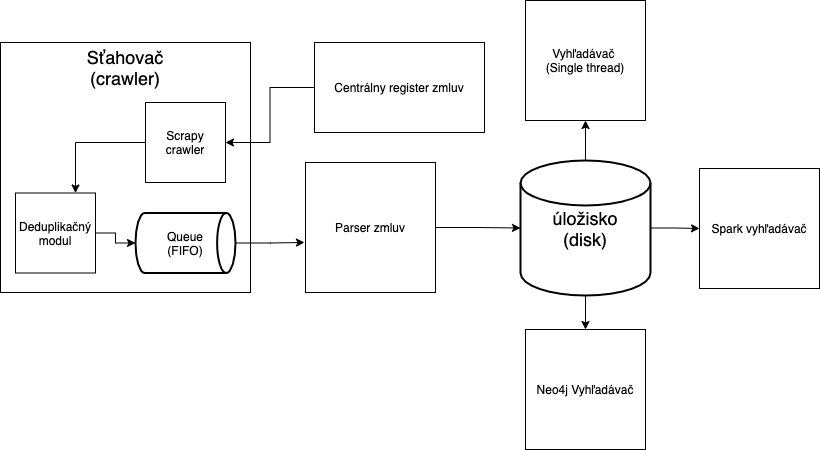

# Návrh riešenia

## Architektúra riešenia


### Sťahovač (crawler)
Z centrálneho registra zmluv pomocou sťahovača (crawlera) stiahnem údaje o zmluvách. 
Prehľadávanie prebieha do šírky (FIFO), rešpektujúc podmienky CRZ.
Sťahovač si ukladá hashe navštívených URL aby zabránil duplikátnemu navštíveniu tej istej URL. Hashe sú perzistentne ukladané a načíané aj medzi jednotlivými behmi.
S využitím regulárnych výrazov sú extrahované atribúty zmluvy. Parsovanie zmluv je pokryté automatizovanými testami pre zaistenie čo najpresnejšej extrakcie atribútov.
Záznamy sú zapísané na disk vo forme csv súboru.
Na sťahovanie bol použitý framework `scrapy`.

#### Pseudokód
```
def visit_url():
    items = extract_contract_detail_links()
    next_page = extract_next_page_link()

    for i in items:
        if not already visited:
            parse(i)
    visit_url(next_page_url)

def parse(url):
    visit(url)
    contract = parse_attributes()
    mark_url_visited(url)
    store_data(contract)
    
visit_url('https://www.crz.gov.sk/zmluvy/')
```

###  Indexovanie
Zo záznamov je vytvorená neorientovaná grafová štruktúra. Uzol reprezentuje fyzickú/právnicku osobu a hrana reprezentuje uzatvorenie zmluvy. Hrana obsahuje aj atribúty uzatvorenej zmluvy.

### Vyhľadávanie
Pomocou prehľadávania do šírky je prehľadaný graf. Ak existuje cesta medzi dvoma zadanými entitami, vyhľadávač vráti túto cestu.
Na vyhľadanie a indexovanie použijem vstavané moduly jazyka Python 3.10.

#### Pseudokód prehľadávania
```
data = read_file()
graph = build_graph()

   def BFS(start_node):
        mark_vertices_as_not_visited()
        queue.add(start_node)
        set_visited(start_node)
 
        while queue:
            s = queue.get_first()
            for neighbor of s:
                if not visited(neighbor):
                    queue.add(neighbor)
                    set_visited(neighbor)
```

## Dátový tok
Nasledujúci diagram zachytáva tok dát medzi kľučovými komponentami, opísanými vyššie.


## Dataset
[Centrálny register zmluv (CRZ)](https://www.crz.gov.sk/zmluvy/) obsahuje 2 698 312 zmlúv. Zverejňované sú od roku 2011.
Nasledujúca tabuľka ilustruje ukážku vyextrahovaných dát z CRZ.


